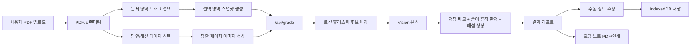

# 시스템 아키텍처

## 1. 권장 기술 스택

### 프론트엔드

- Next.js App Router
  - 업로드 화면, 채점 결과 화면, 로컬 기록 열람까지 한 저장소에서 관리
- React + TypeScript
  - PDF 선택 UI와 결과 대시보드의 상태를 안정적으로 관리
- `react-pdf` + `pdfjs-dist`
  - 브라우저에서 PDF를 캔버스로 렌더링
  - 선택 영역을 정규화 좌표로 저장 가능
- Dexie + IndexedDB
  - 채점 기록, 선택된 문제 스냅샷, 해설 이미지, 수동 수정 내역 저장
- `html2canvas` + `jsPDF`
  - 오답 노트 화면을 PDF로 내보내기

### 백엔드

- Next.js Route Handler
  - 별도 서버 없이 `/api/grade`로 Vision 파이프라인 구성
- OpenAI Responses API
  - 질문 이미지와 답안 페이지 이미지를 함께 넣어 OCR, 문항 매칭, 풀이 흔적 분석, 피드백 생성

## 2. 전체 데이터 흐름

## 3. 사용자 흐름

1. 사용자가 단일 PDF 또는 분리 PDF를 업로드한다.
2. 시험 메타데이터를 입력한다.
3. 문제 PDF에서 채점할 문제 영역만 드래그한다.
4. 답안지/해설이 있는 페이지를 선택한다.
5. 브라우저는 원본 PDF를 저장하지 않고 선택 영역 이미지와 답안 페이지 이미지만 서버에 전달한다.
6. 서버는 페이지 제목, 쪽수, 문항 번호, 표식, 풀이 흔적을 종합해 자동 채점한다.
7. 결과 화면에서 문항별 문제 이미지와 답안 해설 이미지를 같이 본다.
8. 사용자는 잘못된 판정을 한 번 클릭으로 수정한다.
9. 전체 기록은 로컬 IndexedDB에 저장되고, 틀린 문제만 모은 오답 노트를 PDF로 출력한다.

## 4. 구현이 까다로운 부분의 핵심 구조

### PDF 영역 선택 UI

- 페이지 렌더링은 브라우저 캔버스에서 수행
- 드래그한 사각형은 픽셀 좌표가 아니라 정규화 좌표로 저장
- 그래서 화면 크기가 바뀌어도 동일한 문항 영역을 다시 복원 가능
- 선택 완료 시:
  - 문제 스냅샷 이미지 생성
  - 전체 페이지 이미지 생성
  - 페이지 텍스트 스니펫 추출
  - 채점 payload에 포함

### 풀이 흔적 분석 및 채점 로직

- 1단계: 로컬 텍스트 휴리스틱으로 답안 후보 페이지 순위화
  - `p.34`, `34쪽`, `모의고사`, `중단원 점검` 같은 힌트 비교
- 2단계: Vision 모델이 선택 문항과 후보 답안 페이지들을 함께 분석
  - 문항 번호 추정
  - 정답/해설 위치 bbox 추정
  - 객관식/단답형/서술형 구분
  - 학생 답안 인식
  - 풀이 흔적 기반 `solved / guessed / blank / unclear` 판정
- 3단계: 서버가 응답 형식을 다시 정규화
  - bbox 범위 보정
  - 빠진 필드 기본값 보강
  - summary 재계산

## 5. 현재 저장소에서 대응되는 파일

- `components/pdf-area-selector.tsx`
  - 페이지 선택, 영역 드래그, 스냅샷 추출
- `app/api/grade/route.ts`
  - Vision 요청, 응답 정규화, 폴백 처리
- `lib/page-matching.ts`
  - 답안 후보 페이지 휴리스틱 랭킹
- `components/results-dashboard.tsx`
  - 문제별 보기 버튼, 해설 이미지 표시, 수동 수정, 오답 노트
- `lib/local-db.ts`
  - IndexedDB 기록 저장
